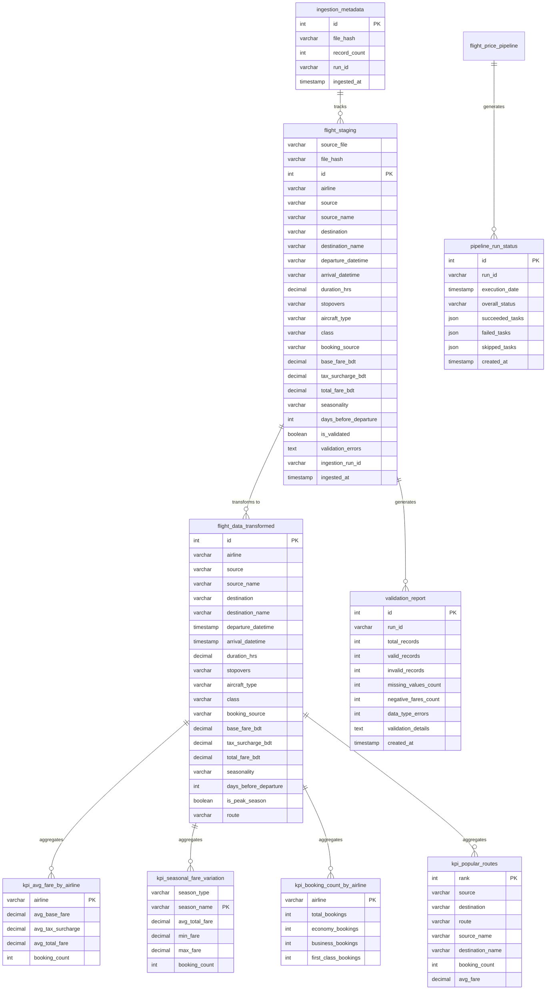
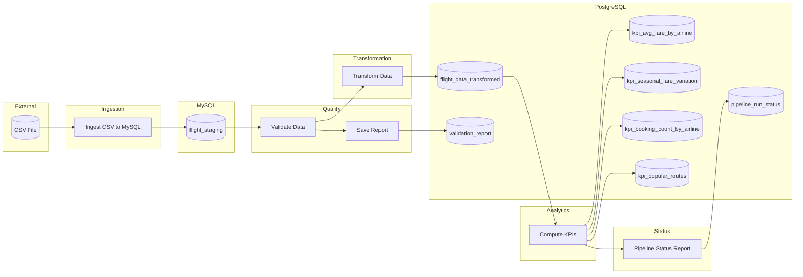

# Flight Price Data Pipeline

End-to-end Apache Airflow pipeline for processing and analyzing Bangladesh flight price data.

## Table of Contents
- [Features](#features)
- [Prerequisites](#prerequisites)
- [Quick Start](#quick-start)
- [Pipeline Overview](#pipeline-overview)
- [KPI Outputs](#kpi-outputs)
- [Configuration](#configuration)
- [Project Structure](#project-structure)
- [Testing](#testing)
- [Troubleshooting](#troubleshooting)
- [Documentation](#documentation)

---

# operations                     

### Entity Relationship Diagram (ERD)



### Pipeline Flow Diagram



---

## Features

- Data Quality Framework: Structured validation similar to Great Expectations
- Idempotent Ingestion: Hash-based change detection to skip unchanged files
- Multi-File Support: Append strategy preserves data from multiple CSV sources
- Schema Evolution: Automatic detection and handling of schema changes
- SQL Pushdown: KPI computation pushed to database for performance
- Lineage Tracking: Full data lineage from source to KPIs
- Configuration Management: Centralized config via Airflow Variables or environment
- Connection Pooling: Optimized database connections with configurable pool settings
- TaskGroups: Organized DAG structure for better visualization
- Failure Resilience: Trigger rules ensure quality tasks run even if upstream fails
- Pipeline Status Reports: Automatic status summary and alerting at end of each run

---

## Prerequisites

- Docker and Docker Compose (v2.14.0+)
- Kaggle dataset: Flight Price Dataset of Bangladesh

---

## Quick Start

### 1. Clone and Setup

```bash
cd flight-price-pipeline

# Create required directories
mkdir -p logs plugins data/raw
```

# Generate Fernet key:
python -c "from cryptography.fernet import Fernet; print(Fernet.generate_key().decode())"

# Generate secret key:
python -c "import secrets; print(secrets.token_urlsafe(32))"
```

### 3. Add Dataset

Download the CSV from Kaggle and place it in the data folder:

```
data/raw/Flight_Price_Dataset_of_Bangladesh.csv
```

### 4. Start Services

```bash
# Set Airflow UID (Linux/Mac)
echo "AIRFLOW_UID=$(id -u)" >> .env

# For Windows PowerShell, add to .env:
# AIRFLOW_UID=50000

# Build and start all services
docker-compose up -d --build

# Check service status
docker-compose ps
```

### 5. Setup Airflow Connections

```bash
# Wait for services to be healthy, then run:
docker exec flight-airflow-worker python /opt/airflow/Database/setup_connections.py
```

### 6. Access Airflow UI

- URL: http://localhost:8080
- Username: admin
- Password: (as configured in .env)

### 7. Run the Pipeline

1. Find `flight_price_pipeline` in the DAGs list
2. Toggle the DAG to "Active"
3. Click "Trigger DAG" to run manually
4. Monitor progress in the Graph or Grid view

---

## Pipeline Overview

The pipeline processes flight price data through four TaskGroups:

### Ingestion TaskGroup

- Loads CSV into MySQL staging table
- Chunked reading (10,000 rows) for memory efficiency
- Idempotent: skips if file unchanged (hash-based detection)
- **Append Strategy**: Preserves data from multiple source files
- Source file tracking: Each row tagged with `source_file` and `file_hash`
- Detects schema evolution in source data

### Quality TaskGroup

- Validates data using DataQualityValidator framework
- Checks: null values, negative fares, data types, value ranges
- Auto-corrects fixable issues (absolute values for negative fares)
- Recalculates Total Fare if mismatched
- Saves validation report to PostgreSQL

### Transformation TaskGroup

- Parses datetime fields
- Adds computed columns: is_peak_season, route
- Ensures Total Fare = Base Fare + Tax
- Loads enriched data to PostgreSQL analytics table

### Analytics TaskGroup

- Computes KPIs using SQL pushdown for performance
- Four KPI tables populated in a single task

### Pipeline Status Report

- Runs at the end of every pipeline execution
- Uses `TriggerRule.ALL_DONE` to run regardless of upstream failures
- Summarizes all task statuses (succeeded, failed, skipped)
- Logs status report and saves to `pipeline_run_status` table
- Enables alerting and monitoring integration

---

## KPI Outputs

| KPI                     | Table                          | Description                       |
|-------------------------|--------------------------------|-----------------------------------|
| Average Fare by Airline | kpi_avg_fare_by_airline        | Mean base, tax, total fares       |
| Seasonal Variation      | kpi_seasonal_fare_variation    | Peak vs non-peak fare comparison  |
| Booking Counts          | kpi_booking_count_by_airline   | Bookings per airline by class     |
| Popular Routes          | kpi_popular_routes             | Top 20 routes by booking volume   |

### Query KPI Results

```bash
# Connect to PostgreSQL
docker exec -it flight-postgres psql -U airflow -d analytics

# View average fares
SELECT * FROM kpi_avg_fare_by_airline ORDER BY avg_total_fare DESC;

# View seasonal variation
SELECT * FROM kpi_seasonal_fare_variation ORDER BY season_type, avg_total_fare DESC;

# View top routes
SELECT rank, route, booking_count, avg_fare 
FROM kpi_popular_routes 
ORDER BY rank LIMIT 10;
```

---

## Configuration

### Environment Variables

Configure in `.env` file :

```env
# Security Keys (REQUIRED)
AIRFLOW_FERNET_KEY=your-fernet-key
AIRFLOW_SECRET_KEY=your-secret-key

# Database Credentials
POSTGRES_USER=airflow
POSTGRES_PASSWORD=your-secure-password
MYSQL_USER=airflow
MYSQL_PASSWORD=your-secure-password

# Pipeline Settings (Optional)
FLIGHT_PIPELINE_CHUNK_SIZE=10000
FLIGHT_PIPELINE_PEAK_SEASONS=Eid,Hajj,Winter

# Connection Pool (Optional)
DB_POOL_SIZE=5
DB_MAX_OVERFLOW=10
```

### Airflow Variables

Optional configuration via Airflow UI (Admin > Variables):

| Variable                           | Description                    |
|------------------------------------|--------------------------------|
| flight_pipeline_csv_path           | Path to CSV file               |
| flight_pipeline_chunk_size         | Ingestion chunk size           |
| flight_pipeline_peak_seasons       | JSON array of peak seasons     |
| flight_pipeline_schema_evolution   | Enable schema detection (bool) |
| flight_pipeline_lineage_tracking   | Enable lineage tracking (bool) |

---

## Project Structure

```
flight-price-pipeline/
|-- docker-compose.yml          # Docker services configuration
|-- Dockerfile                  # Custom Airflow image
|-- .env.example                # Environment template
|-- requirements.txt            # Python dependencies
|-- README.md                   # This file
|
|-- dags/
|   |-- flight_price_pipeline.py    # Main Airflow DAG with TaskGroups
|   |-- __init__.py
|   |-- pipeline/
|       |-- __init__.py
|       |-- config.py               # Configuration management
|       |-- constants.py            # Shared constants and connections
|       |-- data_quality.py         # Data quality framework
|       |-- ingestion.py            # CSV ingestion with idempotency
|       |-- kpis.py                 # KPI computation (SQL pushdown)
|       |-- lineage.py              # Lineage tracking
|       |-- reports.py              # Validation report saving
|       |-- schema_evolution.py     # Schema change detection
|       |-- transformation.py       # Data transformation
|       |-- validation.py           # Data validation
|
|-- scripts/
|   |-- init_mysql.sql              # MySQL schema initialization
|   |-- init_postgres.sql           # PostgreSQL schema initialization
|   |-- setup_connections.py        # Airflow connection setup
|
|-- tests/
|   |-- test_dag.py                 # Comprehensive test suite
|
|-- data/
|   |-- raw/                        # CSV dataset location
|
|-- docs/
|   |-- PIPELINE_DOCUMENTATION.md   # Technical documentation
|
|-- logs/                           # Airflow logs
|-- plugins/                        # Custom Airflow plugins
```

---

## Testing

Run the test suite:

```bash
# Run all tests
pytest tests/ -v

# Run with coverage
pytest tests/ --cov=dags/pipeline --cov-report=html

# Run specific test class
pytest tests/test_dag.py::TestDataQualityValidator -v
```

Test coverage includes:

- Data quality framework validation
- Schema evolution detection
- Lineage tracking
- Configuration management
- KPI computation logic
- Edge cases (empty data, null values)

---

## Troubleshooting

### Services Not Starting

```bash
# Check container logs
docker-compose logs -f

# Check specific service
docker-compose logs airflow-scheduler
```

### Database Connection Issues

```bash
# Connect to MySQL staging database (interactive)
docker exec -it flight-mysql mysql -uroot -proot_password -D staging

# Test MySQL connection (non-interactive)
docker exec flight-mysql mysql -uroot -proot_password -e "SHOW DATABASES;"

# Useful MySQL queries once connected:
# SHOW TABLES;
# SELECT COUNT(*) FROM flight_staging;
# SELECT source_file, file_hash, COUNT(*) FROM flight_staging GROUP BY source_file, file_hash;

# Connect to PostgreSQL analytics database (interactive)
docker exec -it flight-postgres psql -U airflow -d analytics

# Test PostgreSQL connection (non-interactive)
docker exec flight-postgres psql -U airflow -d analytics -c "\dt"
```

### DAG Not Appearing

```bash
# Check scheduler logs
docker-compose logs airflow-scheduler | tail -50

# Verify DAG syntax
docker exec flight-airflow-webserver python -c "from dags.flight_price_pipeline import dag; print(dag)"
```

### Reset Everything

```bash
# Stop and remove all containers and volumes
docker-compose down -v

# Rebuild and start fresh
docker-compose up -d --build
```

### View Task Logs

- Via Airflow UI: Click on task > Log
- Via filesystem: logs/dag_id=flight_price_pipeline/run_id=.../task_id=.../

---

## Documentation

- [Pipeline Technical Documentation](docs/PIPELINE_DOCUMENTATION.md) - Detailed task descriptions, KPI logic, and challenges

---

