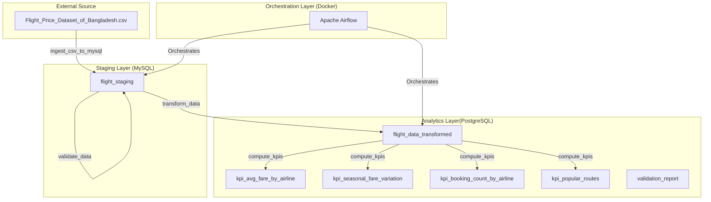
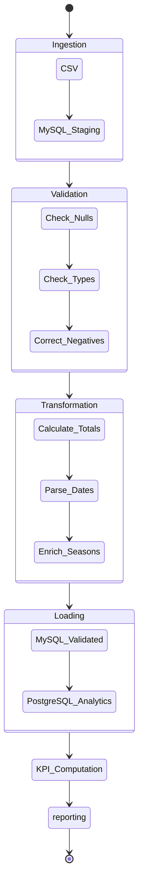

# Flight Price Data Pipeline - Technical Documentation

## 1. Pipeline Architecture

The pipeline follows a hybrid database architecture, utilizing **MySQL** for high-volume staging and **PostgreSQL** for advanced analytics and KPI persistence.

### 1.1 Architecture Diagram

### 1.2 Technology Stack

| Component        | Technology           | Purpose                                       |
| ---------------- | -------------------- | --------------------------------------------- |
| Orchestration    | Apache Airflow 2.8.0 | Workflow scheduling and monitoring            |
| Staging DB       | MySQL 8.0            | Rapid data ingestion and validation           |
| Analytics DB     | PostgreSQL 15        | Enriched data storage and KPI computation     |
| Message Broker   | Redis 7              | Celery task queue management                  |
| Containerization | Docker Compose       | Service orchestration and isolation           |
| Data Processing  | Python/Pandas        | Data cleaning, transformation, and enrichment |

---

## 2. DAG Task Descriptions

The `flight_price_pipeline` DAG consists of six primary tasks:

### Task 1: `ingest_csv_to_mysql`

- **Goal**: Load raw data from the CSV file into a MySQL staging area.
- **Logic**: Loads the full dataset into memory using Pandas (suitable for datasets under 1GB). Column names are mapped from CSV headers to database-friendly snake_case.
- **Append Strategy**: Instead of truncating all data, removes only rows from the same source file before inserting. This preserves data from multiple CSV files.
- **Source Tracking**: Each row is tagged with `source_file` (filename) and `file_hash` (MD5 hash) for traceability.
- **Idempotency**: Skips ingestion if the file hash matches the last ingestion for that specific source file.
- **Target**: MySQL `flight_staging` table.

### Task 2: `validate_data`

- **Goal**: Ensure data integrity and consistency within the staging table.
- **Checks**:
  - Verifies existence of required columns: `Airline`, `Source`, `Destination`, `Base Fare`, `Tax & Surcharge`, `Total Fare`.
  - Handles `NULL` values by filling with appropriate defaults (e.g., "Unknown" for categories, 0 for fares).
  - Validates data types and constraints (e.g., ensuring fares are numeric).
  - Corrects inconsistencies: Calculates absolute values for negative fares.
- **Target**: Updates `is_validated` flag in MySQL `flight_staging`.

### Task 3: `transform_data`

- **Goal**: Enrich data and transfer it to the analytics environment.
- **Enrichment Logic**:
  - **Total Fare Calculation**: If `Total Fare` is missing or 0, it is computed as `Base Fare + Tax & Surcharge`.
  - **Datetime Parsing**: Converts departure and arrival strings into proper TIMESTAMP objects.
  - **Peak Season Flag**: Identifies peak travel periods (Eid, Hajj, Winter).
  - **Route Generation**: Combines source and destination codes into a single `route` string.
- **Transfer**: Loads the enriched dataset into PostgreSQL `flight_data_transformed`.

### Task 4: `compute_kpis`

- **Goal**: Generate business-ready metrics for reporting.
- **Logic**: Leverages SQL aggregations on the PostgreSQL analytics table for speed and accuracy.
- **Outputs**: Populates `kpi_*` tables in PostgreSQL.

### Task 5: `save_validation_report`

- **Goal**: Audit trail of data quality for every pipeline run.
- **Trigger Rule**: Uses `ALL_DONE` to run even if validation task fails.
- **Target**: PostgreSQL `validation_report`.

### Task 6: `pipeline_status_report`

- **Goal**: Summarize pipeline execution status and enable alerting.
- **Logic**: Collects all task instance states from the current DAG run, categorizes as succeeded/failed/skipped.
- **Trigger Rule**: Uses `ALL_DONE` to always run, regardless of upstream task status.
- **Outputs**:
  - Logs a summary report to Airflow logs
  - Saves status to PostgreSQL `pipeline_run_status` table
  - Returns structured status dict for downstream integrations
- **Target**: PostgreSQL `pipeline_run_status`.

---

## 3. KPI Definitions & Logic

### 3.1 Average Fare by Airline

Calculates the mean financial metrics for each carrier.

- **Logic**: `AVG(base_fare_bdt)`, `AVG(tax_surcharge_bdt)`, `AVG(total_fare_bdt)` grouped by `airline`.

### 3.2 Seasonal Fare Variation

Compares travel costs between high-demand seasons and regular periods.

- **Peak Seasons**: Defined as `Eid`, `Hajj`, and `Winter`.
- **Logic**: Aggregates `total_fare_bdt` comparing `is_peak_season = TRUE` vs `FALSE`.

### 3.3 Booking Count by Airline

Measures volume and segment distribution.

- **Logic**: `COUNT(*)` for total volume, plus segment counts for `Economy`, `Business`, and `First` classes.

### 3.4 Most Popular Routes

Identifies high-traffic corridors.

- **Logic**: `COUNT(*)` grouped by `route`, ranked in descending order to identify the top 20 source-destination pairs.

---

## 4. Challenges & Resolutions

| Challenge                          | Resolution                                                                                                                                                                                               |
| :--------------------------------- | :------------------------------------------------------------------------------------------------------------------------------------------------------------------------------------------------------- |
| **SQLAlchemy 2.0 Incompatibility** | Encountered `AttributeError: 'Connection' object has no attribute 'commit'`. Resolved by transitioning to `engine.begin()` blocks for automatic transaction management and wrapping raw SQL in `text()`. |
| **Port Conflict (3306)**           | The default MySQL port `3306` was in use on the host. Remapped the host port to `3307:3306` in `docker-compose.yml` and updated the `.env` configuration.                                                |
| **Missing Infrastructure**         | Initially lacked a MySQL staging service in the Docker setup. Added a dedicated `mysql:8.0` service with proper health checks and initialization scripts.                                                |
| **Undefined Connections**          | Airflow tasks failed due to missing `mysql_staging` connection. Resolved by defining connections directly via `AIRFLOW_CONN_*` environment variables in `docker-compose.yml` for automated setup.        |
| **Data Mismatch**                  | CSV column headers contained spaces and special characters. Implemented a robust `COLUMN_MAPPING` utility to standardize names across the pipeline.                                                      |
| **Data Loss on Multi-File**        | Original TRUNCATE strategy deleted all data when loading new files. Switched to append strategy with source file tracking—only removes rows from the same source before inserting.                      |
| **Pipeline Breaking on Failure**   | Single task failure caused entire pipeline to halt. Implemented `TriggerRule.ALL_DONE` on quality and status tasks to ensure reporting continues even when upstream fails.                               |

---

## 5. Failure Resilience

The pipeline uses Airflow trigger rules to ensure critical tasks run even when upstream tasks fail:

| Task                      | Trigger Rule | Behavior                                      |
| :------------------------ | :----------- | :-------------------------------------------- |
| `validate_data`           | `ALL_DONE`   | Runs even if ingestion fails                  |
| `save_validation_report`  | `ALL_DONE`   | Runs even if validation fails                 |
| `pipeline_status_report`  | `ALL_DONE`   | Always runs to report final status            |
| All other tasks           | `ALL_SUCCESS`| Default—only runs if upstream succeeded       |

This ensures:
- Validation reports are always saved for debugging
- Pipeline status is always reported for alerting
- Failed runs still produce actionable diagnostics

---

## 6. Execution Flow

